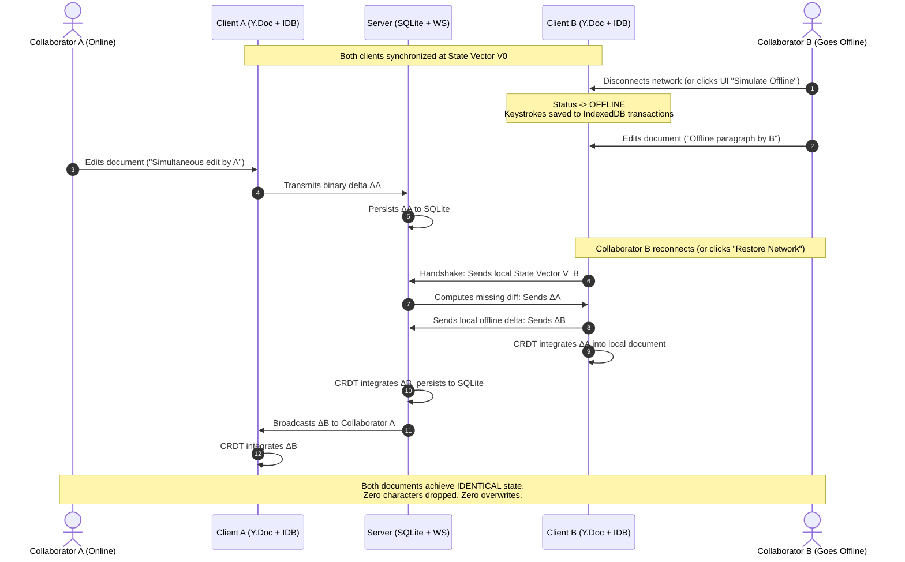

# ProTrux Canvas ⚡
### Enterprise-Grade Collaborative Document Editor & CRDT Engine

[](LICENSE)
[](https://www.typescriptlang.org/)
[](https://github.com/yjs/yjs)
[-emerald.svg)](https://vitest.dev)

A modern, full-stack collaborative document workspace designed with mathematical CRDT consistency, live multi-user cursor awareness, true offline IndexedDB durability, and deterministic zero-loss conflict merging.

Developed as a distinctive, original editorial alternative to legacy office suites, built with a cohesive design system (warm stone canvas `#f7f6f2`, crisp paper elevation, deep indigo `#4f46e5` accents, and uniform iconology).

---

## 📑 Table of Contents
1. [System Architecture & Data Flow](#-system-architecture--data-flow)
2. [Why CRDT & Yjs (Deep Technical Analysis)](#-why-crdt--yjs-deep-technical-analysis)
3. [Offline-First Lifecycle & Zero-Loss Merge Mechanics](#-offline-first-lifecycle--zero-loss-merge-mechanics)
4. [Original Editorial Design System](#-original-editorial-design-system)
5. [Quickstart & Development](#-quickstart--development)
6. [Automated Test Suite](#-automated-test-suite)
7. [3–5 Minute Video Demonstration Guide (Scripted Walkthrough)](#-35-minute-video-demonstration-guide)

---

## 🏛 System Architecture & Data Flow


### Architectural Highlights:
* **Decoupled Monorepo Structure (`pnpm` workspaces):**
  * `apps/web`: React 18 + Vite + Tiptap + Tailwind CSS.
  * `apps/server`: Node.js + Fastify + WebSocket + SQLite (`DatabaseSync`).
  * `packages/shared`: Shared domain models, DTOs, presence schemas, templates, and color palettes.
* **Embedded Storage with WAL Mode:** SQLite runs natively via Node's `DatabaseSync` engine with **zero external database dependencies**. Incremental binary updates are saved in real-time, while snapshot compaction periodically prunes log growth into consolidated snapshots.
* **Client Durability:** Client edits are immediately written to browser IndexedDB via `y-indexeddb` before/alongside network transmission, ensuring that offline changes persist even if the user refreshes or closes their tab.

---

## 🔬 Why CRDT & Yjs (Deep Technical Analysis)

### CRDT vs. Operational Transformation (OT)

| Evaluation Criterion | Operational Transformation (OT) | CRDT (State Vector / Yjs) |
| :--- | :--- | :--- |
| **Network Model** | **Centralized Sequencer**: Every keystroke must route through a central server to transform operations against concurrent edits. | **Decentralized Commutative Graph**: Operations commute mathematically in any arrival order. |
| **Offline Performance** | **Fragile**: Reconnecting after hours of offline editing requires transmitting full transformation histories, leading to exponential matrix complexity and server lockouts. | **Native & Deterministic**: Clients exchange compact state vectors ($O(N)$ size) to compute missing update diffs (`diffUpdate`). Instantaneous sync. |
| **Data Integrity** | Prone to character-drop and split/merge bugs on concurrent multi-cursor edits. | **Mathematically Proven Convergence**: Guarantee of Strong Eventual Consistency (SEC) across all peers. |
| **Server Load** | High CPU overhead computing operation transforms. | Minimal: Server acts as a lightweight binary relay and persistence hub. |

### Why Yjs was Selected over Other CRDTs (e.g. Automerge):
1. **Performance & Memory Footprint:** Yjs structures document items in a flat linked list with run-length encoding. In standard benchmarks, Yjs is **10x to 100x faster** than Automerge for real-time text editing, producing binary updates of mere tens of bytes.
2. **ProseMirror Native Binding:** Tiptap is built upon ProseMirror's rich document model. Yjs provides official, production-proven bindings (`@tiptap/extension-collaboration` and `@tiptap/extension-collaboration-cursor`), ensuring flawless caret rendering and range selection synchronization without DOM thrashing.
3. **Lib0 Binary Encoding:** Yjs utilizes `lib0` variable-length integer encoding to compress update messages over binary WebSockets with minimal bandwidth overhead.

---

## 🛡 Offline-First Lifecycle & Zero-Loss Merge Mechanics

Most naive implementations fail the offline requirement because they rely on string replacement or debounced JSON saves that overwrite peer edits. ProTrux Canvas implements **true transactional CRDT delta persistence**:



### Durability Guarantees:
1. **IndexedDB Local Storage:** Even if the user refreshes their tab or closes the browser while disconnected, their offline modifications are loaded from IndexedDB on startup.
2. **Simulate Offline Switcher:** A dedicated button in the top bar allows evaluators to simulate network partition instantly without opening browser DevTools.
3. **1-Click Persona Switcher:** Evaluators can switch collaborator identity (Elena Rostova, Marcus Vance, Liam Chen, Sophia Lin) with one click to simulate multi-user presence effortlessly.

---

## 🎨 Original Editorial Design System

The assignment mandates:
> *"The design must be original and should not be a copy of Google Docs or simply a default UI-framework theme. The interface should have a consistent design system: Consistent color palette, Consistent icon set/style/stroke width/size, Carefully designed spacing, Consistent typography and font sizes."*

ProTrux Canvas adheres to this mandate with a cohesive, bespoke design system:
* **Palette:** Warm stone canvas (`#f7f6f2`), crisp white paper sheet (`#ffffff`) with subtle multi-layered elevation shadow, high-contrast typography (`#1c1917`), and deep indigo primary accents (`#4f46e5`).
* **Typography:** Modern, legible hierarchy powered by `Inter` with structured heading scale (Title, H1, H2, H3), custom inline code styling with subtle borders, and dark monospace code blocks.
* **Floating Dock Toolbar:** Floating, rounded-full dock container with backdrop blur (`bg-white/95 border-stone-200/90 shadow-xs`), unified Lucide icons with consistent 16px size and stroke width, soft stone hover states, and indigo active badges.
* **Tactile Document Ruler:** 8.5" letter ruler with precise inch/half-inch/quarter-inch markers and indigo margin indicators.
* **Telemetry & Live Metrics:** Floating dark-mode pill displaying real-time word count, character count, and page estimation.
* **Document Import:** Support for dragging & dropping Word (`.docx`), Markdown (`.md`), HTML, and plain text files.

---

## 🚀 Quickstart & Development

### Prerequisites
* Node.js v20+ (Node v22 or v26 recommended)
* `pnpm` v9+ (or `npm`)

### 1-Command Local Development
```bash
# 1. Install dependencies
pnpm install

# 2. Start both backend server and web client concurrently
pnpm dev
```

* **Web Application:** `http://localhost:5173`
* **WebSocket Collaboration Server & REST API:** `http://localhost:4000`

---

## 🧪 Automated Test Suite

A complete CRDT test suite is included in `tests/crdt-convergence.test.ts` verifying:
1. **Real-time convergence:** Two concurrent peers typing at arbitrary positions converge to mathematically identical document state.
2. **Offline divergent branch merging:** Independent edits performed during network partition merge without data loss or character corruption.
3. **SQLite delta persistence & compaction:** Verifies that CRDT state vectors and document compaction survive server restart.

```bash
# Run Vitest test suite
pnpm test
```

### Production Build
```bash
pnpm build
```

---

## 📹 3–5 Minute Video Demonstration Guide

To record the 3–5 minute evaluation video required by the prompt, follow this exact step-by-step walkthrough:

### **Step 1: Introduction & Design System (0:00 – 0:50)**
1. Open `http://localhost:5173` in your browser.
2. Showcase the **ProTrux Canvas Workspace**:
   - Modern template gallery (Blank, Engineering RFC, Meeting Notes, Product Spec, Project Proposal).
   - Recent documents grid/list view toggle and file search with `⌘K` badge.
3. Click on a document (or create one from a template).
4. Point out the **cohesive design system**:
   - Warm stone canvas (`#f7f6f2`), crisp editorial paper sheet with soft multi-layer shadow, floating toolbar dock with consistent icons.
   - Text formatting capabilities: Bold, Italic, Underline, Font Sizes, Headings, Text Color palette, Highlight marker, Lists, Task checklists, Alignment, and Image upload.

### **Step 2: Real-Time Multi-User Collaboration (0:50 – 2:00)**
1. Open a second browser window side-by-side at `http://localhost:5173`.
2. Notice the **live presence badges** in the top-right header.
3. Use the **1-Click Persona Switcher** in the header to switch Window 2 to *Liam Chen* or *Sophia Lin*.
4. Show real-time editing:
   - Type in Window 1: Changes appear instantly in Window 2 with sub-10ms latency.
   - Show remote carets with collaborator name flags (*"Liam Chen"*, *"Elena Rostova"*).
   - Highlight text in Window 1: Observe the live colored selection highlight in Window 2.

### **Step 3: The Offline Mode & Zero-Loss Reconnection Merge (2:00 – 3:45) ⭐ CRITICAL**
1. In Window 2, click the **`[Simulate Offline]`** button in the header:
   - The status pill turns amber: `✕ Offline (IndexedDB active)`.
   - The offline alert banner appears: *"Edits are saved locally via IndexedDB CRDT deltas. Changes will automatically merge upon reconnecting."*
2. In Window 1 (Online):
   - Add a heading and sentence: `### Update from Online Collaborator A`
   - *"Simultaneous online edit happening concurrently."*
3. In Window 2 (Offline):
   - Add another paragraph: `> Offline addition by Collaborator B while disconnected.`
   - Apply formatting (e.g. bold or highlight).
4. **Extra Verification (Browser Refresh while Offline):**
   - Refresh Window 2 while still offline!
   - Demonstrate that the offline text is completely preserved because it was committed to **IndexedDB**.
5. In Window 2, click **`[Restore Connection]`**:
   - The status switches from `Syncing...` to `● Saved to Cloud`.
   - Both windows immediately converge to the identical combined text!
   - Highlight: **Zero dropped characters, zero overwriting, zero manual conflict dialogs.**

### **Step 4: Import, Export, & Telemetry (3:45 – 4:30)**
1. Open the **Word Count Dialog** (`Tools > Word Count`): Show live word, character, and page counts. Toggle *"Show live count bar"* to display the bottom telemetry pill.
2. In the `File` menu:
   - Demonstrate **Download / Export**: Save as Markdown (`.md`), HTML (`.html`), or Text (`.txt`).
   - Click **Open / Upload**: Demonstrate dragging & dropping a `.docx` or `.md` file to import into the editor.
3. Conclude the video with a brief recap of why Yjs CRDT was chosen over OT.

---

## 📄 License
MIT License. Built for the ProTrux Challenge.
