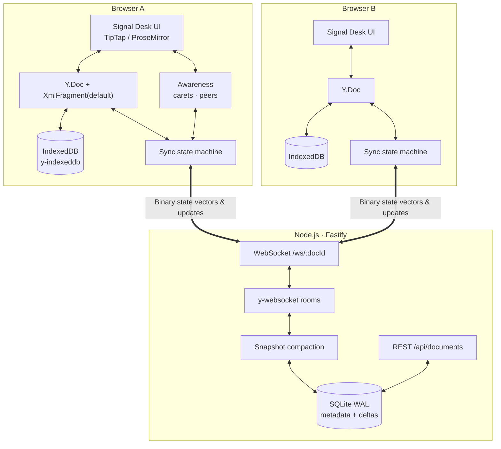
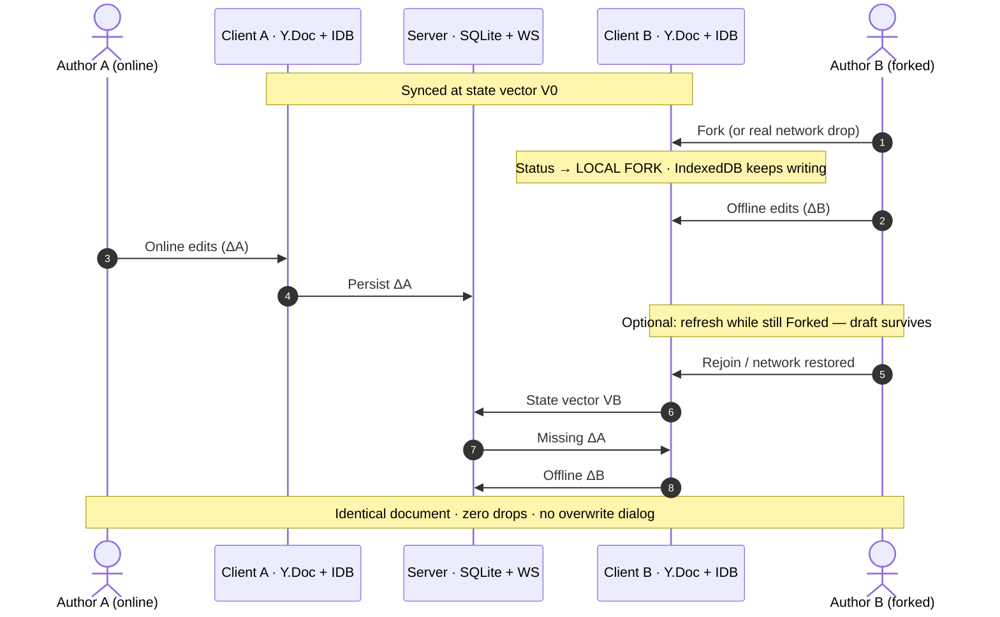

# ProTrux — Signal Desk

### Local-first collaborative document editor with CRDT sync

[](https://www.typescriptlang.org/)
[](https://github.com/yjs/yjs)
[](https://vitest.dev)
[](LICENSE)

A full-stack web document editor built for **real-time multi-author editing**, **true offline durability**, and an **original Signal Desk design** — not a Google Docs visual clone and not a stock UI-kit theme.

**Stack:** React · Vite · TipTap/ProseMirror · Yjs · Fastify · WebSockets · SQLite · IndexedDB

---

## Assignment coverage (MVP checklist)

| Requirement | How ProTrux delivers it |
| :--- | :--- |
| Rich text: bold, italic, headings, lists | TipTap editor + format toolbar (also underline, color, highlight, align, tasks, links, images) |
| Real-time collaboration (≥2 tabs/browsers) | Yjs CRDT over WebSocket; no page reload |
| Offline edit → local persist → correct merge | `y-indexeddb` + Fork control; state-vector merge on reconnect — no overwrite dialog |
| Presence / cursors | Named colored carets, peer count (`MERGED · N`), join/leave toasts |
| Document persistence | SQLite (metadata + CRDT deltas/snapshots) + client IndexedDB |
| Original design system | Signal Desk: carbon drafting table, bone paper, amber signal, Syne + Source Serif |

---

## Table of contents

1. [Quickstart](#quickstart)
2. [Architecture](#architecture)
3. [Why Yjs (CRDT) for sync & offline](#why-yjs-crdt-for-sync--offline)
4. [Offline-first lifecycle](#offline-first-lifecycle)
5. [Design system — Signal Desk](#design-system--signal-desk)
6. [Product surface](#product-surface)
7. [Tests](#tests)
8. [Demo script (3–5 min)](#demo-script-35-min)
9. [Project structure](#project-structure)

---

## Quickstart

**Requirements:** Node 20+, [pnpm](https://pnpm.io) 9+

```bash
pnpm install
pnpm dev
```

| Service | URL |
| :--- | :--- |
| Web app | http://localhost:5173 |
| API + WebSocket | http://localhost:4000 |

Vite proxies `/api` and `/ws` to the server in development.

```bash
pnpm test     # Vitest — CRDT, ACL, REST access
pnpm lint     # ESLint across web + server + tests
pnpm build    # shared → server → web
pnpm start    # production server (serves built web when present)
```

---

## Architecture



### Highlights

- **Monorepo (`pnpm` workspaces):** `apps/web`, `apps/server`, `packages/shared`
- **Server:** Fastify + `ws`; SQLite via Node `DatabaseSync` — no external DB required
- **Client durability:** every edit is persisted in IndexedDB; Fork flag survives refresh (`sessionStorage`)
- **Offline creates:** document metadata can queue in `localStorage` and flush when the API returns
- **Sharing:** private / view / edit modes enforced on **REST and WebSocket**
  - **private** — owner only
  - **edit** — anyone with the document link can open & write (live collab)
  - **view** — link holders sync live; CRDT write frames dropped server-side
  - Share links may include token `k`; a *wrong* `k` is rejected
- **Library:** only your docs + unowned rooms; guests join via shared URL, not the dashboard list
- **Quality gates:** ESLint + Vitest (CRDT convergence, ACL unit tests, REST access inject)

---

## Why Yjs (CRDT) for sync & offline

The brief allows any CRDT/OT library. Writing OT from scratch is **not** a plus. We chose **Yjs** deliberately:

| Criterion | Classic OT | Yjs CRDT |
| :--- | :--- | :--- |
| Network model | Central sequencer for every op | Commutative binary updates; any arrival order |
| Offline | Fragile transform histories | Native: exchange state vectors, merge |
| Integrity | Split/merge edge cases | Strong eventual consistency |
| Server role | Heavy transform CPU | Relay + persist (+ compaction) |
| Editor fit | Custom wiring | Official ProseMirror / TipTap + awareness |

**Why Yjs over Automerge here:** compact binary encoding (`lib0`), battle-tested TipTap collaboration + cursor plugins, and low latency for character-level editing.

The server is **not** the source of truth for merge math — the CRDT is. SQLite stores updates/snapshots so rooms can reload after restarts.

---

## Offline-first lifecycle

This is the criterion the brief says is most often faked. ProTrux treats it as a first-class path.



### Demo controls in the UI

1. **Fork / Rejoin** in the header — partitions the WebSocket; flag survives reload
2. **Chalk “Local fork” banner** — desk desaturates while offline
3. **Persona switcher** — distinct caret colors across tabs (Elena / Marcus / Liam / Sophia)
4. **Mono sync line** — `MERGED · N` / `LOCAL FORK` / `MERGING` / `TUNING`

---

## Design system — Signal Desk

Assignment requirement:

> Design must be original — **not a copy of Google Docs** and not a default UI-framework theme. Judged on **system consistency**: palette, icons, spacing, typography.

| Token | Role |
| :--- | :--- |
| Carbon `#12141a` | Drafting-table desk / chrome |
| Bone `#fffcf7` / `#f3efe6` | Paper & light surfaces |
| Amber signal `#c8890a` / `#e8a84a` | Accent, sync, section labels |
| **Type** | Syne (UI / display) · Source Serif 4 (body) · IBM Plex Mono (signal text) |

**Product metaphor:** a dark engineering desk with one bright sheet under a spotlight. Sync is typography (`MERGED · 2`), not green “Synced” pills. Offline is a **local fork**, not a toast that pretends nothing happened.

Useful Docs-like *capabilities* (page size, ruler, export, image resize) exist as tools — the chrome, palette, and motion language stay Signal Desk, not a Drive clone.

---

## Product surface

Beyond the MVP floor:

- **Home:** specimen templates with mini paper previews, document library, import
- **Editor:** page setup (Letter / A4 / custom), inch ruler with draggable margins, zoom
- **Formatting:** styles, fonts, size, color, highlight, lists, tasks, links
- **Images:** insert from file/URL; **Docs-style resize handles** (width syncs via CRDT)
- **Download:** PDF (print → Save as PDF), Word (`.docx`), Markdown, HTML, plain text
- **Share:** private / view / edit — enforced on REST + WebSocket (not UI-only)
- **Theme:** light / dark chrome; paper stays bone for reading

---

## Tests

```bash
pnpm test
```

`tests/crdt-convergence.test.ts` (7 cases):

1. Concurrent online convergence  
2. Offline divergent merge (text)  
3. TipTap-shaped `XmlFragment('default')` offline merge  
4. Encoded-update round-trip (refresh / local ledger model)  
5. SQLite snapshot compaction  
6. Watermark race safety during compaction  
7. Document delete accuracy  

---

## Demo script (3–5 min)

Use this for the submission video.

### 1. Design (0:00 – 0:40)
1. Open http://localhost:5173  
2. Show Signal Desk home: carbon header, amber **SPECIMENS**, mini paper previews — **not Drive**  
3. Open **Resume (Modern)** — dark desk, bone page, amber section labels, mono `MERGED · 1`

### 2. Real-time collaboration (0:40 – 2:00)
1. Duplicate the tab / open the same `#doc=…` URL side-by-side  
2. Window 2 → persona → **Liam Chen** or **Sophia Lin**  
3. Type in both windows — live carets + name labels  
4. Point at header: `MERGED · 2`

### 3. Offline + zero-loss merge (2:00 – 3:50) ★
1. Window 2 → **Fork** — chalk **Local fork** banner; status → `LOCAL FORK`  
2. Window 1 (online): add a heading or paragraph  
3. Window 2 (offline): add different text + bold / highlight  
4. **Optional proof:** refresh Window 2 while still Forked — content survives  
5. Window 2 → **Rejoin** — both converge; status → `MERGED · 2`. No conflict dialog, no lost text

### 4. Close (3:50 – 4:30)
1. **File → Page setup** or drag ruler margins  
2. Click an image → show resize handles (or insert one quickly)  
3. **File → Download → PDF** or Word  
4. One-line close: *“Yjs CRDT so offline merges are math — not last-write-wins.”*

---

## Project structure

```
ProTrux-task/
├── apps/
│   ├── web/                 # React + Vite + TipTap (Signal Desk UI)
│   │   └── src/
│   │       ├── components/  # Editor shell, header, dashboard, modals
│   │       │   └── toolbar/ # DocsToolbar pieces (PortalMenu, constants)
│   │       ├── extensions/  # FontSize, ResizableImage
│   │       ├── constants/   # API endpoint map
│   │       ├── hooks/       # useCRDT, useDocuments
│   │       ├── lib/         # cn, date helpers
│   │       ├── services/    # CRDT manager, API, export, owner-key
│   │       ├── store/       # Zustand (docs, user, page, theme)
│   │       └── providers/   # Modal host
│   └── server/              # Fastify + WebSocket + SQLite
│       └── src/
│           ├── access.ts    # Shared REST/WS ACL
│           ├── app.ts       # buildApp (HTTP + WS + shutdown)
│           ├── api/         # REST document routes
│           ├── crdt/        # Persistence, typed y-websocket wrapper, view-only filter
│           └── db/          # SQLite schema & access
├── packages/shared/         # Types, templates, presence helpers
├── tests/                   # Vitest: CRDT, ACL, REST access
├── data/                    # SQLite files (local)
└── package.json             # pnpm workspace scripts (dev/build/test/lint)
```

---

## License

MIT. Built for the ProTrux collaborative-docs challenge.
