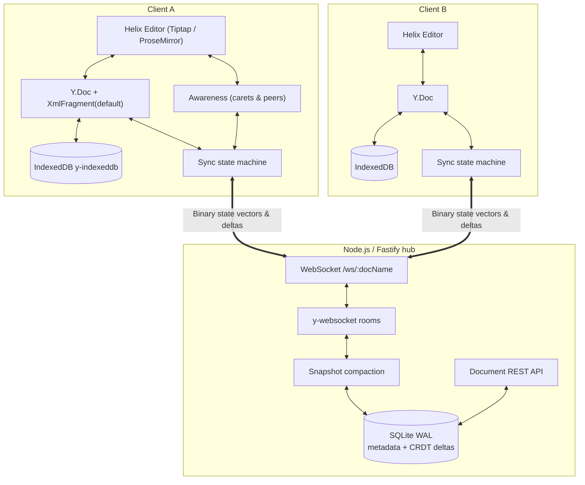
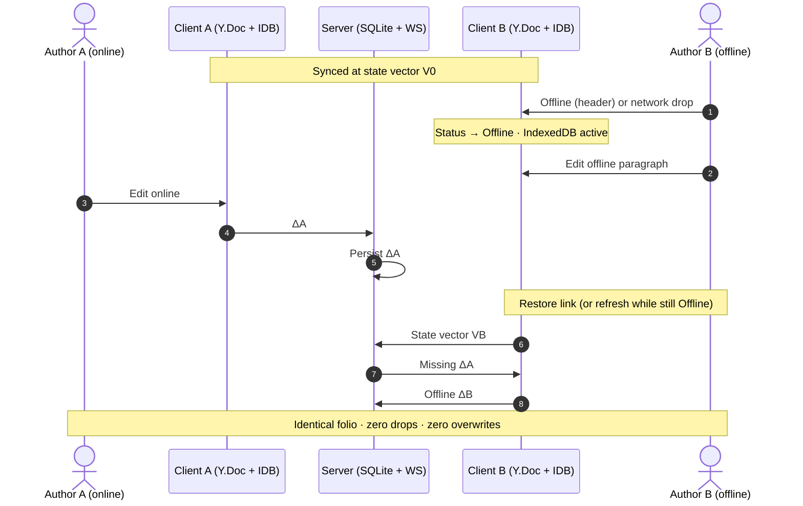

# Helix by ProTrux
### Local-first collaborative folio editor with CRDT sync

[](LICENSE)
[](https://www.typescriptlang.org/)
[](https://github.com/yjs/yjs)
[](https://vitest.dev)

A full-stack collaborative writing workspace with mathematical CRDT consistency, live multi-author carets, IndexedDB offline durability, and deterministic zero-loss merge on reconnect.

Built as an **original editorial product** (Helix) — not a Google Docs visual clone and not a stock UI-kit theme. Design system uses **three colors only**: ink `#13201c`, forest `#1f6f5c`, mist `#eef3f1` (plus tints/shades). Typography: Fraunces + Manrope + Source Serif 4.

---

## Table of Contents
1. [System Architecture](#system-architecture--data-flow)
2. [Why CRDT & Yjs](#why-crdt--yjs)
3. [Offline-First Lifecycle](#offline-first-lifecycle)
4. [Original Design System](#original-design-system)
5. [Quickstart](#quickstart)
6. [Tests](#tests)
7. [3–5 Minute Demo Script](#35-minute-demo-script)

---

## System Architecture & Data Flow



### Highlights
- **Monorepo (`pnpm` workspaces):** `apps/web` (React + Vite + Tiptap), `apps/server` (Fastify + WebSocket + SQLite), `packages/shared` (types, templates, presence).
- **Server persistence:** Node `DatabaseSync` SQLite — no external DB. Incremental binary updates + periodic snapshot compaction.
- **Client durability:** Every edit hits IndexedDB via `y-indexeddb` before/alongside the wire. Simulate Offline survives **tab refresh** via `sessionStorage`.
- **Offline creates:** If REST is unreachable, folio metadata is queued in `localStorage` and flushed when the link returns.

---

## Why CRDT & Yjs

| Criterion | OT | CRDT (Yjs) |
| :--- | :--- | :--- |
| Network | Central sequencer for every op | Commutative deltas; any arrival order |
| Offline | Fragile transform histories | Native: exchange state vectors, merge |
| Integrity | Split/merge edge bugs | Strong eventual consistency |
| Server load | Heavy transform CPU | Lightweight binary relay + store |

**Why Yjs (vs Automerge):** run-length linked list, tiny binary updates, official ProseMirror/Tiptap collaboration + cursor bindings, `lib0` encoding.

---

## Offline-First Lifecycle



### Demo controls
1. **Offline / Reconnect** in the chrome — partitions the WebSocket; flag persists across reload.
2. **Persona switcher** — Elena / Marcus / Liam / Sophia for clear caret colors (use a second tab).
3. **Presence rail** — live author color spectrum under the format dock (not an inch ruler).

---

## Original Design System

Assignment requirement:
> Design must be original — **not a copy of Google Docs** and not a default UI-framework theme. Judged on system consistency: palette, icons, spacing, typography.

Helix response:
- **3 colors:** Ink `#13201c`, Forest `#1f6f5c`, Mist `#eef3f1` — warn/live/success are forest tints, not coral/lime.
- **Type:** Fraunces (display), Manrope (UI), Source Serif 4 (body).
- **IA:** Folio · Compose · Embed · Style · Lab — not File/Edit/View/Insert/Format/Tools.
- **Canvas:** continuous rounded folio column with spine accent — not an 8.5×11 Docs page + ruler.
- **Chrome:** floating format dock, sync chips (`Synced` / `Merge` / `Linking` / `Offline`), presence rail.

---

## Quickstart

```bash
pnpm install
pnpm dev
```

- Web: `http://localhost:5173`
- API / WebSocket: `http://localhost:4000` (Vite proxies `/ws` and `/api`)

```bash
pnpm test    # Vitest CRDT + SQLite suite
pnpm build   # production build
```

---

## Tests

`tests/crdt-convergence.test.ts` covers:
1. Concurrent online convergence
2. Offline divergent merge (text)
3. **TipTap-shaped `XmlFragment('default')` offline merge**
4. **Encoded-update round-trip** (local ledger / refresh model)
5. SQLite snapshot compaction
6. Watermark race safety during compaction
7. Document delete accuracy

---

## 3–5 Minute Demo Script

### 1. Design system (0:00 – 0:45)
1. Open `http://localhost:5173`.
2. Show Helix home: template pads, archive grid, ink/forest/mist brand — **not Drive/Docs**.
3. Open a folio. Point out Folio/Compose/Embed/Style/Lab, format dock, presence rail, rounded folio column.

### 2. Real-time collaboration (0:45 – 2:00)
1. Second window side-by-side on the same `#doc=…` URL.
2. Switch Window 2 persona to **Liam Chen** or **Sophia Lin**.
3. Type in both windows — live carets + name flags; highlight shows remote selection.
4. Note peer avatars in the header and Share modal.

### 3. Offline + zero-loss merge (2:00 – 3:50) ★
1. Window 2 → **Offline**: chip turns Offline; banner explains IndexedDB.
2. Window 1 (online): add a heading/paragraph.
3. Window 2 (offline): add different text + bold/highlight.
4. **Optional proof:** refresh Window 2 while still Offline — draft survives (simulate flag + IndexedDB).
5. Window 2 → **Reconnect**: both converge; chip → **Synced**. Zero drops, no conflict dialog.

### 4. Export & wrap (3:50 – 4:30)
1. Lab → Word count (or Metrics on the dock).
2. Folio → Export Markdown/HTML/Text.
3. One-line close: Yjs CRDT chosen for offline-native merge vs OT sequencers.

---

## License
MIT. Built for the ProTrux Challenge.
